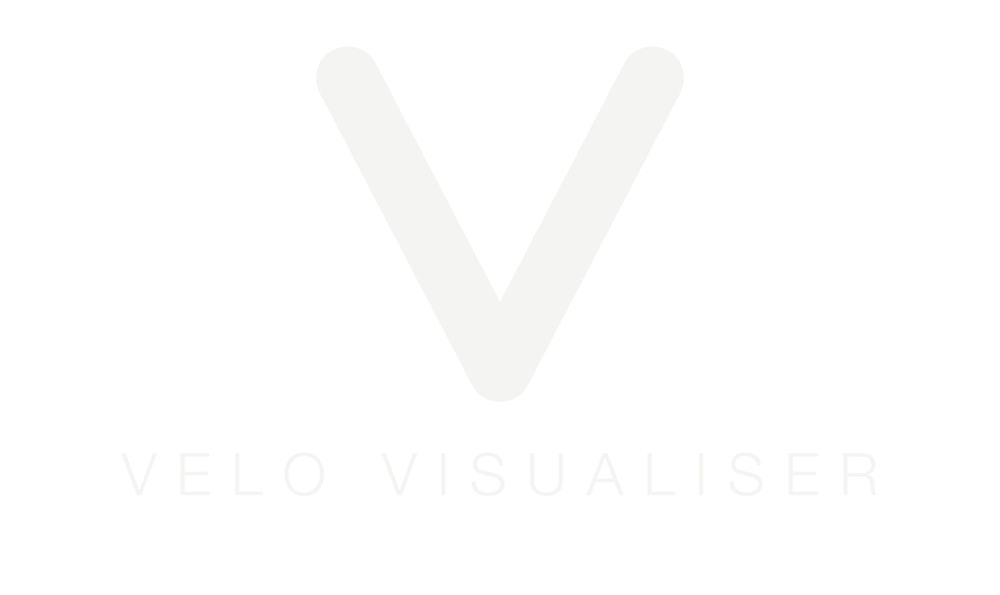

  

## Velo Visualiser: Low Latency Music Visuals and Lighting

Velo Visualiser is an Android audio visualiser engineered around one primary objective: **low latency**. 

When you open the app, you'll see the default oscilloscope visualisation which responds to microphone input in **less than 10ms**. That is faster than:
* **The blink of an eye** (which takes 100–400 ms).
* **Human tactile perception** (the 20–30 ms it takes your brain to register touching a drum pad).
* **The physical speed of sound** travelling from speakers on one side of the room to another (3.4 metres in 10 ms).

A bare-metal C++/Oboe audio engine and custom OpenGL ES 3.1 shaders bypass standard Android bottlenecks to deliver sub-10 ms audio-to-pixel response, whilst also capable of driving smart home lighting and device haptics in real-time.

## What's the app for

1. Primarily visualising music: This offers a modern take on the classic PC visualisers from the 2000s. Except now with 120fps HDR visuals. The visuals are a great showcase for modern Android hardware and supports dynamic scaling so will look great on large tablets and foldables too.
   
2. A live performance tool: That is ideal for home DJs: The visualiser is well suited for use on android based projectors, or large secondary displays as a live performance tool. Its low latency smart home lighting control additionally offers beat synchronised lighting in time with your set 

3. Playing Oscilloscope Music: Features a dedicated, true stereo "Stereo Scope" mode designed to perfectly render the mathematical audio-visual vector art of oscilloscope music (Like Jerobeam Fenderson) . *(Note: This visual is exclusive to 'System Audio' mode. We highly recommend using a lossless audio file like WAV or FLAC for playback, as MP3 or YouTube compression will permanently destroy the shape geometries!)*

## Demo
**Velo Visualiser: Low Latency Music Visualiser Demo Video**

`▶ Watch on YouTube`

## Download on Google Play

Velo Visualiser is available for free on the Google Play Store:

*(Alternatively, prebuilt APKs for direct sideloading are available in the **Releases** tab. Note: Android will show an "Unverified Developer" warning on install — tap "More details" → "Install anyway.")*

## Reacts to the sound. Locks to the set.

Velo Visualiser listens to the **actual sound** in the room and moves with it instantly. The sub-10 ms reaction is what the visuals are built on. Switch on **[Ableton Link](https://www.ableton.com/en/link/)** (Works with Traktor, Ableton Live, Serato and more) and Velo Visualiser also locks onto your set's tempo, layering a tightly-timed **extra punch and bloom** over the top — even *anticipating* each beat a hair before it lands, the way only a shared musical clock can. The faithful "instrument" visuals (oscilloscope, spectrum, meters) stay a pure readout of the sound, while the reactive scenes get that grid-locked accent. Sound drives the picture; Link adds the polish.

*(And as experimental extras: Bar-synced glow and drop-triggered surges - for when you want the visuals to follow the arrangement, not just the beat.)*

## Core Features
* **High-FPS, HDR-Capable 3D Visuals:** Targets 120+ fps for fluid, tear-free rendering (device and preset dependent).
* **True Stereo Oscilloscope Rendering:** Includes a specialised X/Y "Stereo Scope" visual for rendering mathematical vector audio art (Oscilloscope Music). Requires System Audio capture and lossless audio files for perfect phase alignment.
* **Ableton Link Integration:** Supplement the microphone input with perfect phase-synchronization and predictive beat detection broadcast directly from your DJ software (Traktor, Live, Serato).
* **Smart Home Room Lighting Control:** Drive your physical room lighting with the exact same zero-lag transient detection used for the on-screen visuals. Supports Philips Hue, Lifx bulbs, and Nanoleaf panels.
* **No Nonsense:** 100% local processing. No data collection. No ads. I don't want your data, and nobody wants ads.

## The full feature list

- **42 audio and beat reactive visualizers**: Waveforms, spectra, particle fluids, scrolling spectrograms, dot-matrix LED meters, and more.
- **HDR Effects**: Including post-processing for real luminous glow on capable HDR displays and a selectable glow strength.
- **Ableton Link sync**: Lock beat-driven effects to Traktor, Ableton Live, and other Link software over Wi-Fi; the mic still drives the visuals while Link sets the beat.
- **Real-time Room Lighting Control with Philips Hue, LIFX & Nanoleaf Integration**: Direct local UDP streaming over the Hue Entertainment API, LIFX LAN Protocol, and Nanoleaf ExtControl. Also works in co-ordination with Ableton Link to drive a synchronised beat to the bulbs. Includes advanced controls for calibration and the ability to send Ableton Link beats early for perfect synchronisation.
- **Two audio sources**: Raw low-latency microphone capture or internal/system audio via screen-share (Warning: Low latency not supported via screen-sharing).
- **Global colour themes**: Re-tint visuals to your desired colour scheme (Neon, Warm, Cool, Mono…).
- **Vibrate-on-beat haptics**: Bass-onset detection triggers physical pulses.
- **Supports External Displays**: Plug an external display into your android device to display visuals on a large display.
- **Ambient Mode**: A burn-in-safe standby screen featuring an  clock, live BPM, and an audio-presence meter over the dimmed visuals so you can use turn a propped-up phone into a desk/shelf piece. Swipe to browse visuals without leaving.
- **Foldable & Tablet Support**: Open a foldable phone and the render loop will survive the screen state changes without recreating.
- **Diagnostics Overlay Toggle**: Displays FPS, audio latency, Ableton link status, Hue drop rates and more.

## Why Velo Visualiser is Fast

### 1. The Simple Breakdown
By bypassing the Android system mixer and utilizing C++ zero-copy memory transfers, Velo Visualier processes the sound, calculates the frequencies, and paints the pixels on your screen in **~8.0 ms**.

### 2. The Detailed Breakdown (Hardware-to-Retina)
Here is the end-to-end latency estimate for Velo Visualiser's gold-standard path (Microphone to Screen) on a modern Android device:

| Stage | Component | Est. Latency |
|---|---|---|
| **Capture** | Microphone Hardware + Oboe exclusive path | ~2.0 ms |
| **Ingest** | Native Engine Ring Buffer write | < 0.1 ms |
| **Analysis** | Native C++ 128-bin FFT (KissFFT) | ~0.3 ms |
| **Transfer** | Shared DirectBuffer (Zero-Copy) | < 0.1 ms |
| **Render** | GPU Shader execution (120Hz frame budget) | ~4.0 ms |
| **Display** | OLED Panel Scan-out response | ~1.5 ms |
| **TOTAL** | **Hardware-to-Retina** | **~8.0 ms** |

Many visualisers suffer from inherent 100ms+ delays due to their reliance on high-level Java APIs like `AudioFlinger` or `android.media.audiofx.Visualizer`. Velo Visualiser eliminates these bottlenecks by operating at the OS hardware floor.

### 3. System Audio Latency (The Shared Path)
Velo Visualiser allows you to visualize internal device audio (like Spotify or YouTube) using screen-capture APIs, but the latency profile is fundamentally different:

* **Inherent OS Buffer:** ~40–80 ms
* **Total End-to-End:** ~60–100 ms

This higher latency is an unavoidable Android OS limitation when intercepting shared system audio. However, Velo Visualiser utilizes NEON CPU optimizations for this path. While NEON cannot lower the OS buffer delay, it ensures the CPU footprint remains microscopic during the 60ms capture window, guaranteeing the visualizer never stutters or drops frames while waiting for the system audio buffer.

### 4. Smart Lighting Latency (Philips Hue)
While the app's internal beat calculation is near-instant (< 1 ms), the physical time required to change a lightbulb is bottlenecked by your local network and the Hue Bridge's Zigbee mesh. Total time from beat-detection to physical light change is **~40–70 ms**:

| Stage | Approx. Time |
|-------|---------|
| Packet build + DTLS encrypt | < 0.5 ms |
| Wi-Fi LAN hop to the bridge | ~1–5 ms |
| Bridge processing | ~10–20 ms |
| Zigbee mesh → physical bulb | ~25 ms |

As part of the roadmap, I intend to add support for ESP32 WLED-based lights via UDP, which bypasses the Zigbee mesh entirely and will be significantly faster.

### 5. Smart Lighting Latency (LIFX)
LIFX bulbs connect directly to your local Wi-Fi router, bypassing the need for a Zigbee bridge. This eliminates the extra bridge processing hop found in Hue setups. Total time from beat-detection to physical light change is generally **~15–30 ms**, depending heavily on your router's performance and the Wi-Fi signal strength at the bulb.

| Stage | Approx. Time |
|-------|---------|
| UDP Packet build | < 0.5 ms |
| Wi-Fi LAN hop directly to bulb | ~1–5 ms |
| Bulb processing & illumination | ~15–25 ms |

### 6. Smart Lighting Latency (Nanoleaf)
Nanoleaf panels also connect directly to your local Wi-Fi and support a high-speed "ExtControl" UDP streaming mode. Latency is similar to LIFX, with the total time from beat-detection to physical light change generally around **~15–30 ms**.

| Stage | Approx. Time |
|-------|---------|
| ExtControl V2 Packet build | < 0.5 ms |
| Wi-Fi LAN hop directly to controller | ~1–5 ms |
| Panel processing & illumination | ~15–25 ms |

## Smart Lighting (Philips Hue Sync)

Velo Visualiser drives Hue lights using the **Hue Stream v2** protocol over **DTLS-PSK encrypted UDP** (Port 2100). 

1. **Pairing:** Swipe up, and select the **Lighting** tab. Tap *Connect Hue Bridge*. The app uses mDNS to find your local bridge. Press the physical button on the bridge when prompted.
2. **Setup:** Select an Entertainment Area (must be created in the official Philips Hue app first).
3. **Persistence:** The `username` and `clientkey` are stored locally via `EncryptedSharedPreferences`. 

## Smart Lighting (LIFX Sync)

Velo Visualiser drives LIFX lights using the **LIFX LAN Protocol** over **raw UDP** (Port 56700).

1. **Discovery:** Tap *Scan for LIFX Bulbs* in the LIFX tab. The app uses UDP broadcast (`Device::GetService`) to find your local bulbs. 
2. **Selection:** Check the boxes next to the bulbs you wish to sync. 
3. **Control:** Sends high-speed `Light::SetColor` packets to update the bulbs at up to 50Hz. No bridge or cloud account is required. 

## Smart Lighting (Nanoleaf Sync)

Velo Visualiser drives Nanoleaf panels using the **ExtControl V2 Protocol** over **raw UDP** (Port 60222).

1. **Discovery:** Open the Nanoleaf tab and click *Scan*. The app uses mDNS (`_nanoleafapi._tcp`) to detect your controller.
2. **Pairing:** Hold the power button on your Nanoleaf physical controller for 5-7 seconds until the lights flash, then tap *Pair* in the app to establish an API token.
3. **Control:** Once paired, tapping *Light Sync* enables high-speed streaming directly to your panels. No cloud account is required.

## Building from Source

If you want to compile yourself, open the project in Android Studio (Meerkat 2024.3.1 or higher).

**Build Requirements:**
* **Android SDK:** `targetSdk 37`
* **NDK:** Version 28+
* **CMake:** 3.22.1
* **Architecture:** `arm64-v8a` only.

**Validation:** run `./gradlew check` before submitting changes — it runs detekt, Android lint, and the unit tests, including headless GLSL shader validation. (`assembleDebug` alone runs none of these.) Optionally `brew install glslang` for full shader compile-checking. See [CONTRIBUTING.md](CONTRIBUTING.md).

## Contributing

See [CONTRIBUTING.md](CONTRIBUTING.md)

## Acknowledgements

Velo Visualiser stands on excellent open source work:
- [Oboe](https://github.com/google/oboe). Low-latency audio
- [Ableton Link](https://github.com/Ableton/link). Tempo sync
- [KissFFT](https://github.com/mborgerding/kissfft). FFT
- [OkHttp](https://square.github.io/okhttp/). Hue REST
- [Bouncy Castle](https://www.bouncycastle.org/). DTLS-PSK
- [Satoshi](https://www.fontshare.com/fonts/satoshi). Core UI typeface
- [Clash Display](https://www.fontshare.com/fonts/clash-display). Spectacle typeface

## License

Velo Visualiser is **free and open source software**, licensed under the
**GNU General Public License v3.0** — see [LICENSE](LICENSE).

You're free to use, study, modify, and redistribute it. Any distributed
derivative must also remain GPLv3.

The **Velo Visualiser name, logo, and icons are trademarks and are not covered by the GPL**
— see [TRADEMARKS.md](TRADEMARKS.md). Forks must rebrand.

No data collection, no ads, no tracking — local-only, and it'll stay that way.

## Support

Velo Visualiser is free but its development cost is not, so if it brings some colour to your music and you'd
like to chip in for coffee, it's hugely appreciated:

## About the Developer

Velo Visualiser was engineered by me, Rory Gallagher. I am a Engineer with over 14 years of experience in enterprise software architecture and currently leading innovation and experimentation teams. My day-to-day focus centers on leading teams to evaluate and build enterprise capabilities using emerging technologies.

Building Velo Visualiser is a culmination of my interests in music technology and audio science, live performance, hardware, software engineering and IoT. The visualiser serves as both a practical tool for live sets and originated from my personal deep-dive in exploring the bare-metal performance limits of native Android audio pipelines and network hardware coordination.

Feel free to connect:
* **LinkedIn:** [linkedin.com/in/rory-gallagher-51822532](https://www.linkedin.com/in/rory-gallagher-51822532)
* **YouTube:** [youtube.com/@rorygallagher-redslug](https://www.youtube.com/@rorygallagher-redslug)
* **Medium:** [medium.com/@rorygallagher2010](https://medium.com/@rorygallagher2010)

